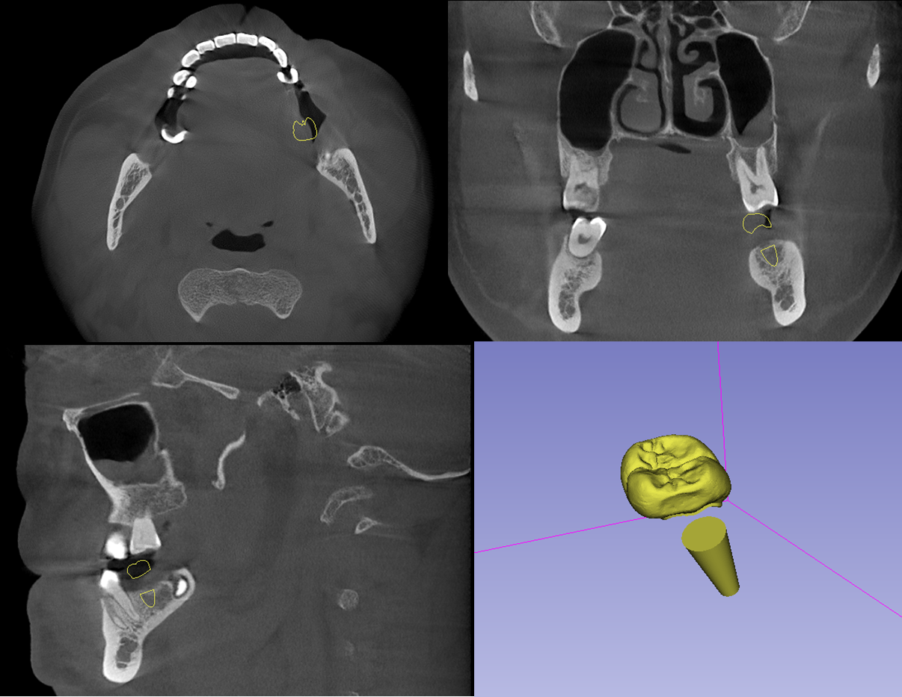

# Automated dental implanting based on image segmentation and prior expertise of oral surgical regulations

A simple Graphic User Interface (GUI) application for automated dental implanting based on segmentation using segmentation and expertise in medical regulations.

This APP takes CBCT scan formatted in DICOM as input, and outputs the crown and implant results in both NIFTI (voxel-based) and STL (mesh) formats.

The idea is now segmentation based. It first locates the missing crowns for implanting patches identification, then for the dental implanting, potential regions are roughly estimated based-on expertise regulation.
The final result of implanting is the intersection of the initial estimation and the prediction performed on another deep learning model again by segmentation.  
